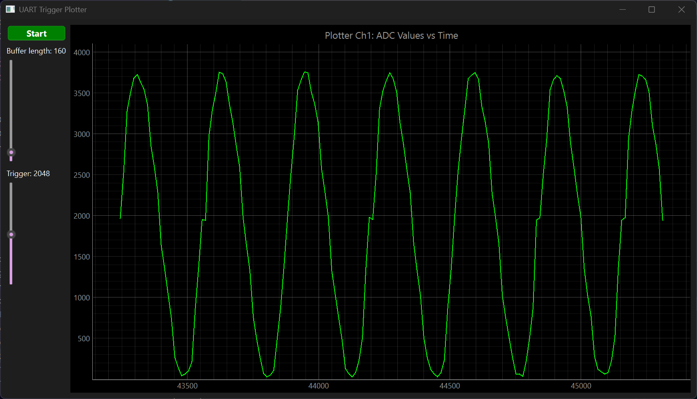
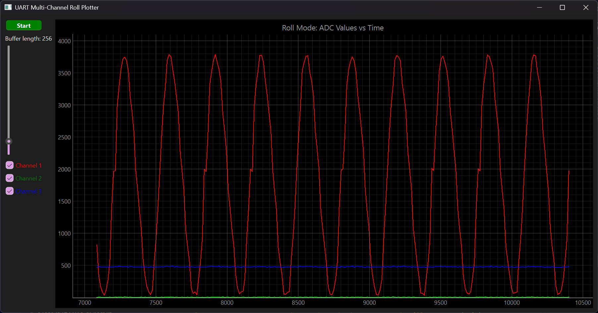
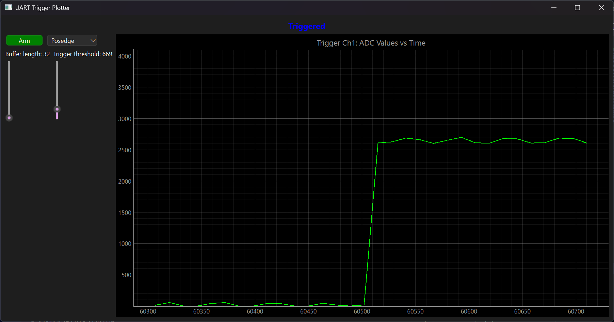

# oscilloscope_v1

### Table of Contents

1. [Project Overview](#project-overview)
2. [Operation](#operation)
3. [Tools Used](#tools-used)
4. [Development](#development)
5. [Final Thoughts](#final-thoughts)

## Project Overview

I don't always have a benchtop oscilloscope with me, nor do I own an Analog Discovery analyzer. The only LCD screens I have are really small and not really practical to use for analysis. When I work on microcontroller programming, actually seeing the signals helps a great deal. It's useful for performance verification, troubleshooting, and understanding the details of signals like PWM.

Printing STM32 data to terminal through UART back to the laptop only gets me so far. I'm limited by my reading speed (which happens to be lower than 1kHz lol). Using scripting to process this data into something more visual is big. This project is my experimentation on using Python scripting to graph ADC data from my STM32F767, making a rudimentary oscilloscope of sorts.

There are a lot of applications for this sort of project. If it's sophisticated enough, this project alone can carry out quite a few tasks that would make debugging a lot easier in future projects. For example, data can be logged over time or viewed as typical oscilloscope data on screen. PWM signals can be captured with triggers and measured.

## Operation

As of now, there are three available modes: normal, roll, and trigger. Normal mode allows you to set a single trigger voltage and displays data starting at that point. Roll mode acts as a data logger, showing live change over time. Trigger acts as a single shot event capture, where a level set posedge or negedge can be captured.

### Examples



The above image shows normal mode. The buffer length adjusts the time range, and the trigger value adjusts the start point.



The above image shows roll mode. The buffer length adjusts the maximum time range as values keep collecting in a queue.



The above image shows trigger mode, which captures the defined edge event.

## Tools Used

I have used an NUCLEO-F767 board for this project. It's what I have, and it's not 'ideal' for signal processing. It has 3 ADCs (of which I have used 1) and one DAC channel (being used). 
There are no internal PGAs, but I have opamp chips if I ever need them.

In programming the controller, I have made use of a standard set of tools: interrupts, DMA control, watchdogs, and UART. Data structures such as buffers and structs were nothing too sophisticated.

This project was more scripting intensive. I chose Python for its libraries and simplicity of coding. I used the libraries ```sys```, ```collections```, ```pyserial```, ```pyqtgraph```, and ```PySide6```. Using ```pyqtgraph``` to build applications was much more effective compared to ```matplotlib``` animations for sure. 
It allowed for faster and more versatile plotting.

> [!NOTE]
> I used the help of [perplexity](https://www.perplexity.ai/) as an AI tool for helping with scripting, troubleshooting and understanding the use of ```PySide6```. ```pyqtgraph``` and ```PySide6``` aren't easy to use, so make sure you understand them properly.

## Development

The goal was to add a good amount of functionality to the microcontroller as well as the python scripts. 
The data was be entirely collected, processed, and formatted in the controller. The scripts should be in charge of queueing the data and plotting it.

I started out with optimizing ADC operation as much as possible. Given the necessity for high frequency conversion, the choice to use the DAC and ADC in DMA circular mode was fairly obvious. 
The circular buffers allowed constant running. 
To allow for reliable periodic measurements, they were configured to capture by a timer trigger event. 
I set the DAC buffer to a sine wave, so adjusting the timer was an easy way of adjusting the input signal frequency. 
I calibrated delays and configured a convenient method of sending data through UART.

> [!NOTE]
> It looks like I just used a plain ol' ```printf``` in my code, but I didn't. If you look at my prototype definitions in [main.c](Core/Src/main.c), you'll see that I retargeted the output of ```fputc``` to use ```HAL_UART_Transmit```. It's a lot easier than using ```sprintf``` to format a string and send the string with HAL functions.

I initially worked out a simple roll mode script through ```matplotlib```. It was fairly messy and slow, having a maximum frequency of 50Hz before the internal buffer caused an accumulating delay in UART data. So I quickly switched to ```pyqtgraph``` for its faster method of operation and improved customizable tools.

> [!WARNING]
> I noticed ```PySide6``` latest version 6.9.1 isn't very stable. Specifically download version 6.9.0.

I got roll mode working first, since it was simply a matter of collecting data in queues and plotting them every time a new value was pushed in. 
The tricky part was the pause button. See, pausing the graph is fine. 
But pausing the buffers causes the laptop buffer to start accumulating, which is bad since the laptop has a pretty big one (I think on the order of kilobytes which is more than enough here). 
So resuming would cause the graph to always lag. 
I kept this in mind for the rest of the project. Pretty cool thing to observe.

> [!TIP]
> You can check your device's UART buffer size for yourself. Whenever your controller transmits through UART, it goes right into the buffer. It only gets received when it fills up or you use ```/r/n```. Print a sequence of numbers and see how far you go!

Trigger was easier. Instead of constantly plotting, it was just waiting for the trigger event. 
When the event occured, the buffer was plotted, emptied, and the graph was frozen in a disarmed state. This took perhaps the least amount of time.

Normal mode was conceptually more complicated for me to wrap my head around. The buffer kept shifting, but when it was plotted, I wasn't sure if I had to clear the queue or not.
Of course, I realized I was being silly when I saw that my sine waves that were captured on posedge were also getting captured on the immediate negedge, since what goes up, comes down! 
Fixed that by clearing the buffer after each plotting event.

An interesting challenge was figuring out the limitations of this oscilloscope. Frequency, resolution, etc. One glaringly clear one is that it's technically better suited to logic analysis since we're limited to 0-3.3V. The fastest that the oscilloscope can collect values from the ADC is extremely high. The TIM_CLK is 96MHz and each ADC conversion takes 3 clock cycles. However, the operation is currently limited by the script, which samples at a rate of upto 1KHz. The brings the highest reliably measurable signal frequency to 250Hz, since you need 4 samples for a single wavelength.

## Final Thoughts

This project was really fun. Took me less time than I expected to complete it. I can see a lot of room for future improvement, starting with more functionality such as measurement tools and new operation modes like FRAs and transforms. FRAs would be made possible if a wavegen was setup. The easiest thing to do would be to make signal capture a lot faster.

Currently, a measurement is taken and immediately sent over UART. Buffers allow some level of allowing the computer to catch up, but it's realistically not too much. A single ```printf``` command can send about 800 ASCII characters before the internal buffer is emptied with an implied ```\r\n```. Formatted properly, that's a LOT of values!. It doesn't speed things up as much as you'd think because of the BAUD rate being limited. It eliminates a whole lot of delays, though. Performance can go up from 250Hz to probably 2kHz. Exciting stuff.

Research on different stuff has also given rise to new ideas that I could implement in the future!
